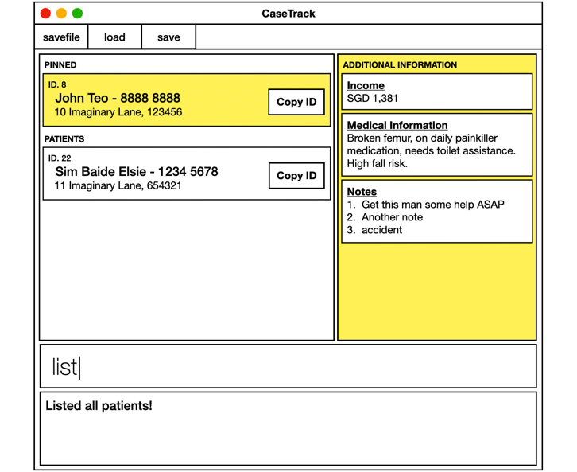

# FAContactsPro

 
 

  

 
 

This project is based on the AddressBook-Level3 project created by the [SE-EDU initiative](https://se-education.org).
* FAContactsPro is an **address book** that is tailored to financial advisors in Singapore. It helps them stay organized by keeping track of their work. 
  Example usages:
  * Add a client/colleague's contact details.
  * Search for a client/colleague contact.
  * Edit a client/colleague contact.
  * Remove a client/colleague contact.
  * List all contacts stored.
  * Exit the application.
* The project is an ongoing software project for a desktop application (called _FAContactsPro_) used for managing clients/colleagues' contact details.
  * It is **written in OOP fashion**.
  * It comes with a **reasonable level of user and developer documentation**.
* It is named `Financial Advisor Contacts Pro` (`FAContactsPro` for short) because we want it to be a premium address book for financial advisors in Singapore.
* For the detailed documentation of this project, see the **[FAContactsPro Product Website](https://ay2526s1-cs2103-f10-1.github.io/tp/)**.
