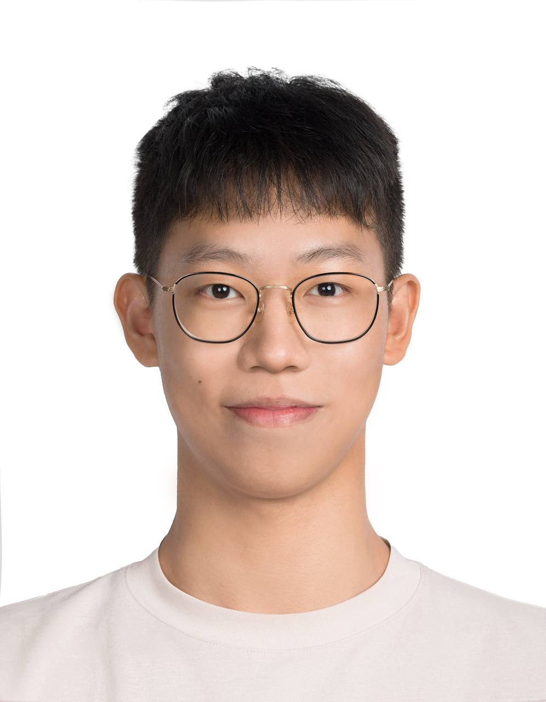
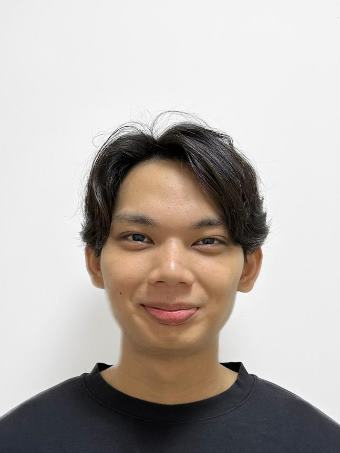
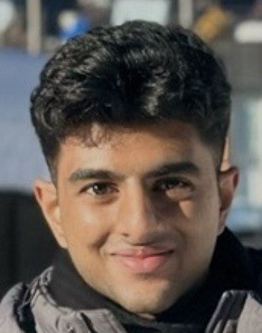

We are a team based in the [School of Computing, National University of Singapore](https://www.comp.nus.edu.sg).

You can reach us at the email `seer[at]comp.nus.edu.sg`

## Project team

### Zhong Rui

 
[[homepage](http://www.comp.nus.edu.sg/~damithch)]
[[github](https://github.com/zhonggruii/tp)]
[[portfolio](team/johndoe.md)]

* Role: Project Advisor

### Darren Sim 

[[github](http://github.com/darrensimmx)]

[[portfolio](team/johndoe.md)]

* Role: Team Lead
* Responsibilities: UI

### Anthony Chow

[[github](http://github.com/mesutantonio)] [[portfolio](team/johndoe.md)]

* Role: Developer
* Responsibilities: Data

### Manish Kharthik

[[github](http://github.com/manishkharthik)]
[[portfolio](team/johndoe.md)]

* Role: Developer
* Responsibilities: Dev Ops + Threading

### Aayush Bhatia

[[github](http://github.com/abhatia2003)]

* Role: Developer
* Responsibilities: UI
