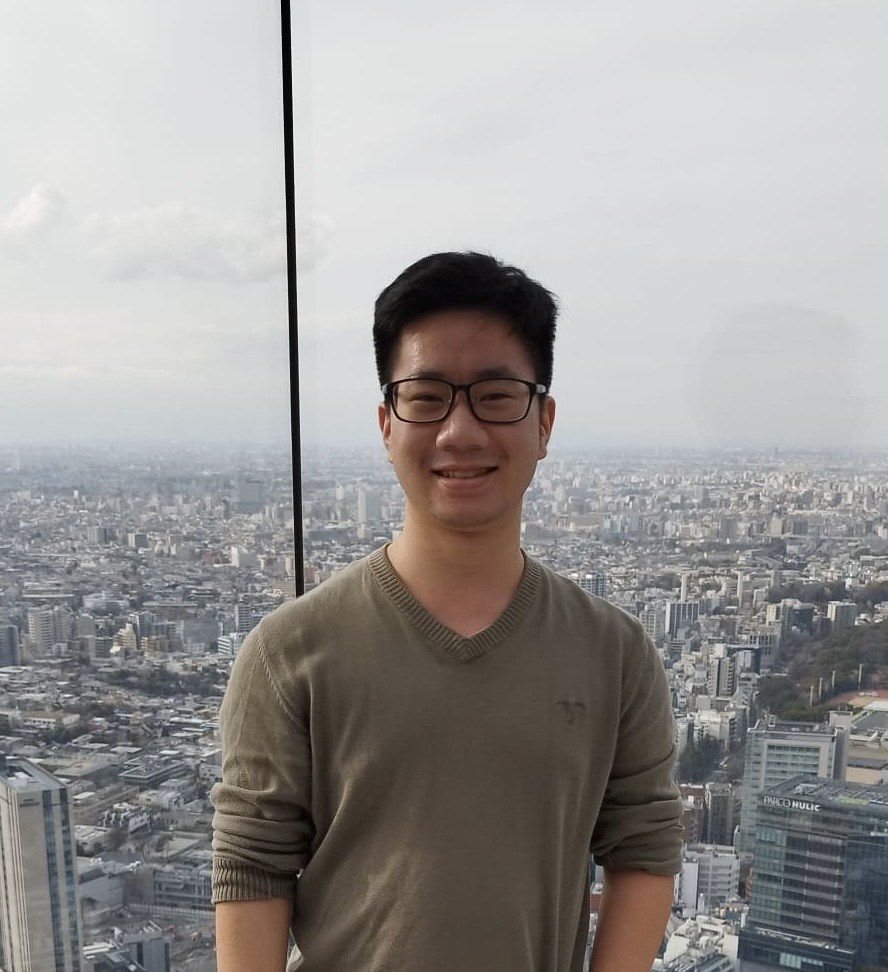
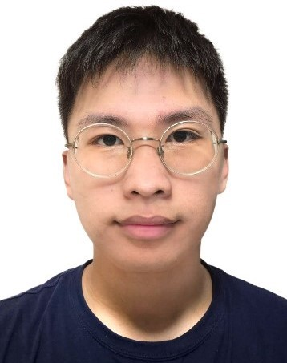
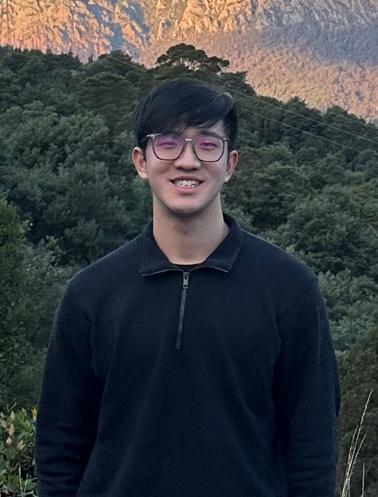

# About Us

We are a team based in the [School of Computing, National University of Singapore](http://www.comp.nus.edu.sg).

You can reach us at the email `seer[at]comp.nus.edu.sg`

## Project team

### Chan Jin Kai

[[homepage](http://www.comp.nus.edu.sg/~damithch)]
[[github](https://github.com/MooMooYonders)]
[[portfolio](team/johndoe.md)]

* Role: Project Advisor
* Responsibilities: Project oversight and guidance

### Justin Ng

[[github](https://github.com/jvvvstin)]
[[portfolio](team/jvvvstin.md)]

* Role: Team Lead
* Responsibilities: UI

### Lum Jing Xiang Isaac

[[github](https://github.com/Zisaac99)] [[portfolio](team/johndoe.md)]

* Role: Developer
* Responsibilities: Integration

### Soh Wei Jie Nicholas

[[github](http://github.com/nicsohlame)]
[[portfolio](team/johndoe.md)]

* Role: Developer
* Responsibilities: Data
