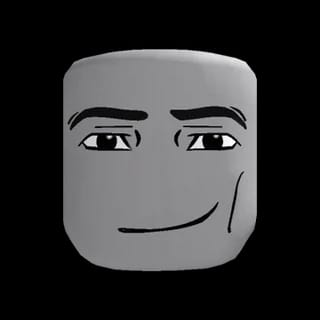
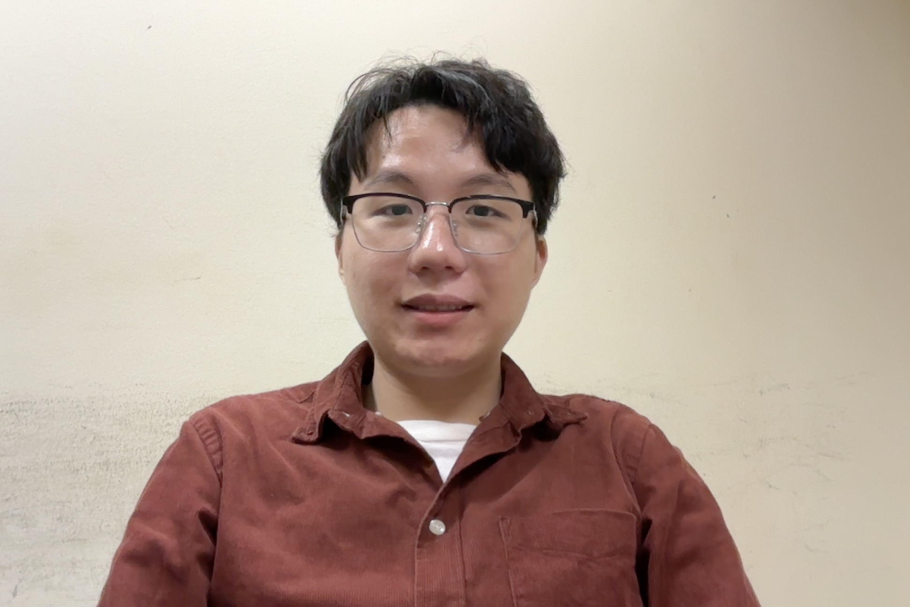
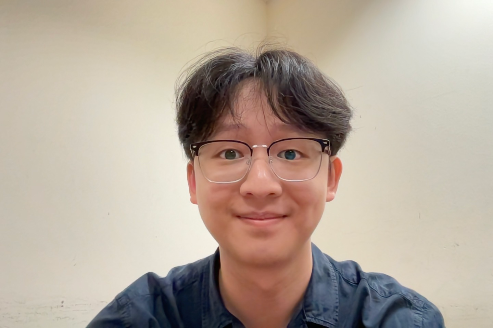

We are a team based in the [School of Computing, National University of Singapore](https://www.comp.nus.edu.sg).

You can reach us at the email `seer[at]comp.nus.edu.sg`

## Project team

### Poh Kai Siang Hanson

[[github](https://github.com/hansonpoh)]
[[portfolio](team/hansonpoh.md)]

* Role: Team Lead

### Max

[[github](https://github.com/Meckss]
[[portfolio](team/max.md)]

* Role: Developer
* Responsibilities: UI

### Javier Lua

[[github](https://github.com/javier-lua)]
[[portfolio](team/javier.md)]
* Role: Project Advisor

### Jean Doe

[[github](http://github.com/johndoe)]
[[portfolio](team/johndoe.md)]

* Role: Developer
* Responsibilities: Dev Ops + Threading

### James Doe

[[github](http://github.com/johndoe)]
[[portfolio](team/johndoe.md)]

* Role: Developer
* Responsibilities: UI
