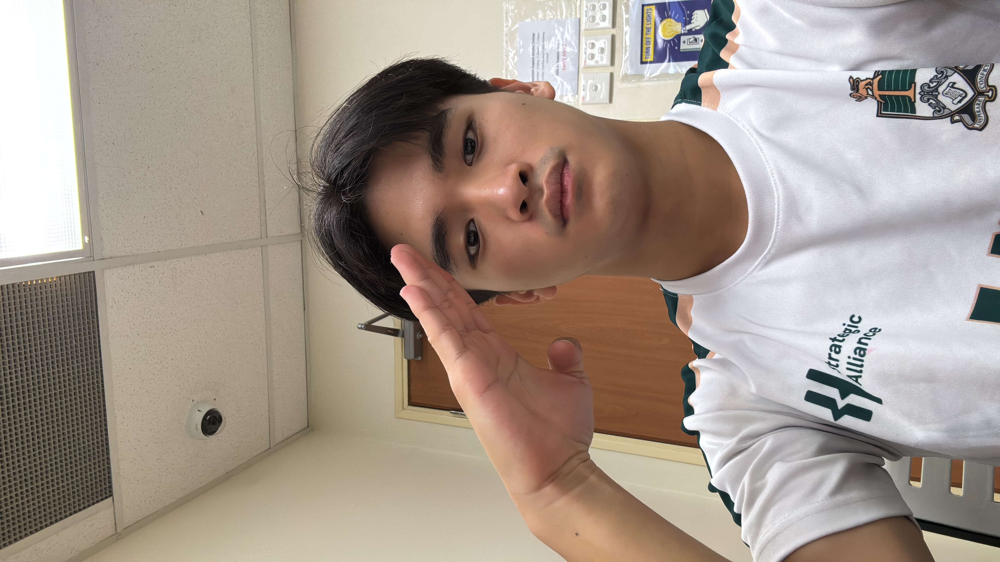
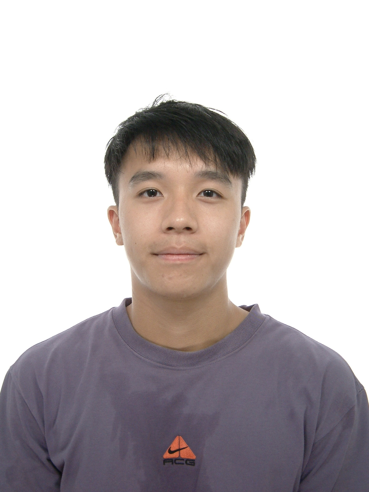

# About Us

We are a team based in the [School of Computing, National University of Singapore](http://www.comp.nus.edu.sg).

You can reach us at the email `e1398671@u.nus.edu`

## Project team

### Dylan Teo

[[github](https://github.com/dylantjy)]

* Role: Documentation; MarkBind administration; Project site
* Responsibilities: UI 

### Alden

[[github](https://github.com/denz-denz)]

* Role: Testing
* Responsibilities: Model

### Mitchel Lee

[[github](http://github.com/actualmulti)]

* Role: Project Management 
* Responsibilities: Model

### Mattheus Cheong

[[github](https://github.com/mattcce)]

* Role: DevOps, CI/CD
* Responsibilities: Parsing

### Xu An

<!-- [[homepage](http://www.comp.nus.edu.sg/~tehxuan)] -->
[[github](https://github.com/xateh)]

* Role: Documentation
* Responsibility: Model
