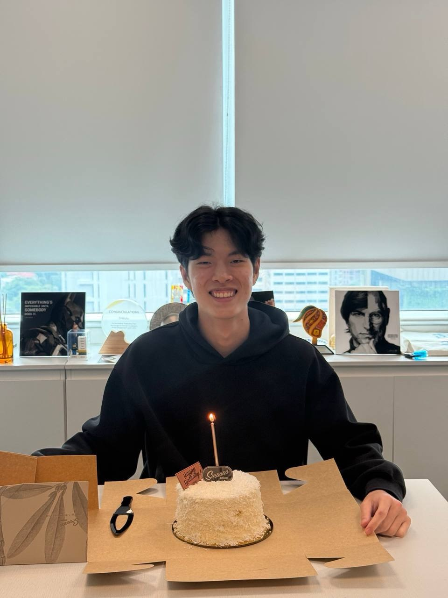
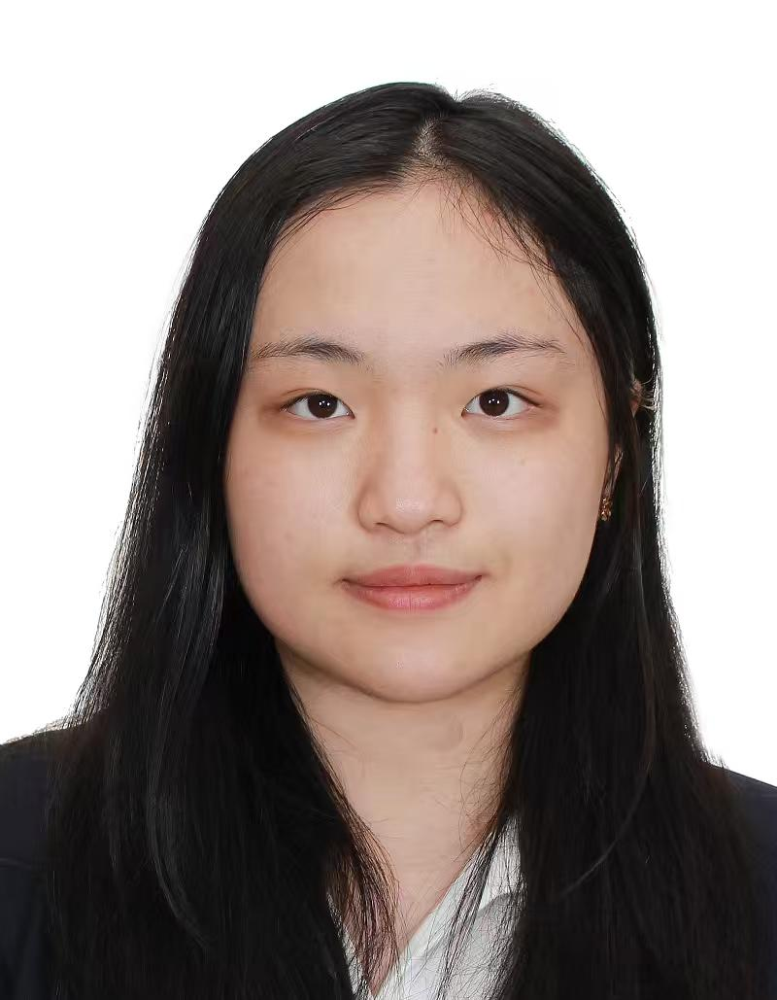
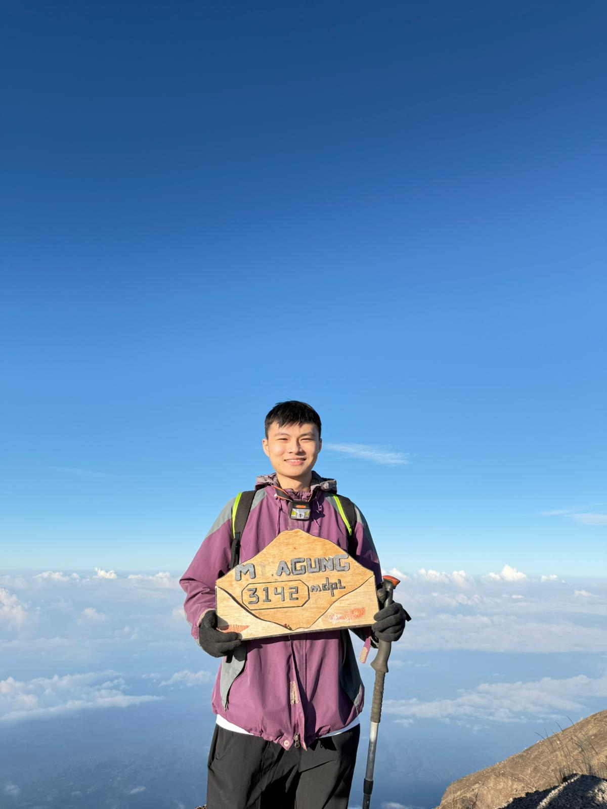

We are a team based in the [School of Computing, National University of Singapore](https://www.comp.nus.edu.sg).

You can reach us at the email `seer[at]comp.nus.edu.sg`

## Project team

### Nickson Ho

[[homepage](http://www.comp.nus.edu.sg/~damithch)]
[[github](https://github.com/nicksonho)]
[[portfolio](team/nicksonho.md)]

* Role: Developer
* Responsibilities: User Testing

### Jane Doe

[[github](http://github.com/yatihe01)]
[[portfolio](team/johndoe.md)]

* Role: Developer
* Responsibilities: Documentation checks

### Johnny Doe

[[github](http://github.com/johndoe)] [[portfolio](team/johndoe.md)]

* Role: Developer
* Responsibilities: Data

### Jean Doe

[[github](http://github.com/johndoe)]
[[portfolio](team/johndoe.md)]

* Role: Developer
* Responsibilities: Dev Ops + Threading

### Chee Yoong

[[github](http://github.com/cheeden)]
[[portfolio](team/cheeden.md)]

* Role: Developer
* Responsibilities: Features and UI
