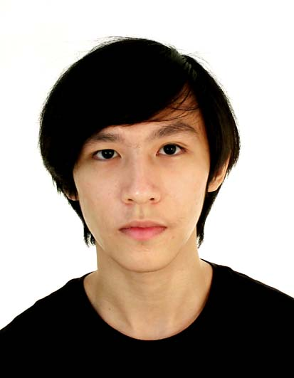
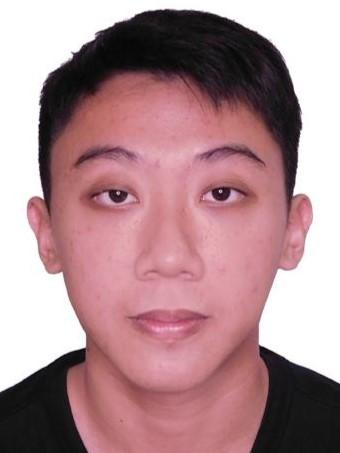
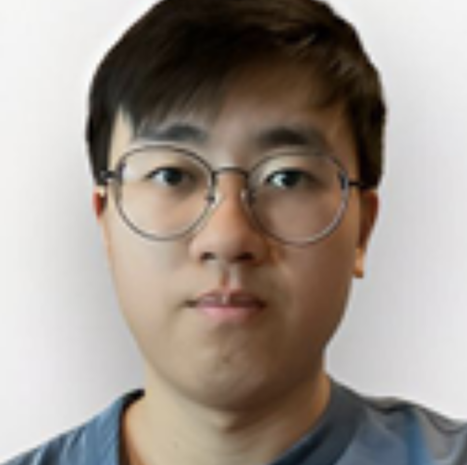

# About Us

We are a team based in the [School of Computing, National University of Singapore](http://www.comp.nus.edu.sg).

You can reach us at the email `seer[at]comp.nus.edu.sg`

## Project team

### John Doe

[[homepage](http://www.comp.nus.edu.sg/~damithch)]
[[github](https://github.com/johndoe)]
[[portfolio](team/johndoe.md)]

* Role: Project Advisor

### Bawa Amarnath Sania

[[github](http://github.com/starshine)]
[[portfolio](team/sania.md)]

* Role: Deliverables and deadlines, Scheduling and tracking
* Responsibilities: Ensure project deliverables are done on time and in the right format.
In charge of defining, assigning, and tracking project tasks

### Lim Tze Shaun

[[github](http://github.com/Juggernaut102)] [[portfolio](team/shaun.md)]

* Role: Testing
* Responsibilities:

### Bryan Leng

[[github](https://github.com/Bleng-flash)]
[[portfolio](team/bryanleng.md)]

* Role: Documentation + Git expert
* Responsibilities: 

### Ryan Toh

[[github](http://github.com/ryan-toh)]
[[portfolio](team/ryan-toh.md)]

* Role: Team Lead
* Responsibilities: UI
