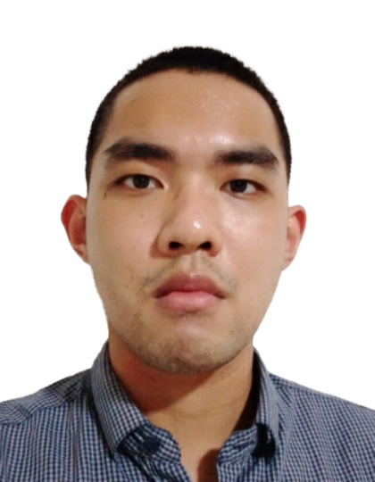

# About Us

We are a team based in the [School of Computing, National University of Singapore](http://www.comp.nus.edu.sg).

You can reach us at the email `seer[at]comp.nus.edu.sg`

## Project team

### Jireh Toh

[[homepage](http://www.comp.nus.edu.sg/~damithch)]
[[github](https://github.com/jireh0108)]
[[portfolio](team/johndoe.md)]

* Role: Project Advisor

### Jordan Loh

[[github](http://github.com/jordanloh)]
[[portfolio](team/johndoe.md)]

* Role: Team Lead
* Responsibilities: UI

### Yue Yang

[[github](http://github.com/yycancode)] [[portfolio](team/johndoe.md)]

* Role: Developer
* Responsibilities: Data

### Liv Tarsilla Poh

[[github](http://github.com/livtarsillapoh)]
[[portfolio](team/johndoe.md)]

* Role: Developer
* Responsibilities: Dev Ops + Threading

### Wei Hao

[[github](http://github.com/learningcoding-pixel)]
[[portfolio](team/johndoe.md)]

* Role: Developer
* Responsibilities: UI
