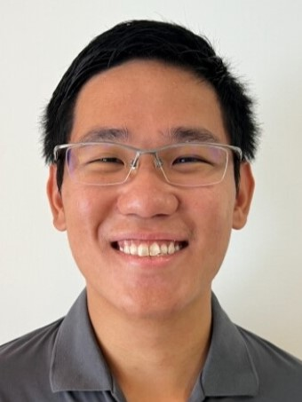

We are a team based in the [School of Computing, National University of Singapore](https://www.comp.nus.edu.sg).

## Project team

### Maximus Ng

[[github](https://github.com/MNJPeng)]
[[portfolio](team/mnjpeng.md)]

* Role: Team Lead
* Responsibilities: Scheduling and Tracking
* In charge of: Storage
* Email: `e1398200@comp.nus.edu.sg`

### Pham Hai Minh

[[github](https://github.com/monnss69)]
[[portfolio](team/monnss69.md)]

* Role: Architecture Design
* Email: `e1375556@u.nus.edu`

### Ivan Ng

[[github](http://github.com/inzk0518)] 
[[portfolio](team/inzk0518.md)]

* Role: Developer
* Responsibilities: Code Standard
* In charge of: Model
* Email: `e1375763@u.nus.edu`

### Weng Mun

[[github](https://github.com/wengmu)]
[[portfolio](team/wengmu.md)]

* Role: Developer
* In charge of: Testing
* Email: `e1354203@u.nus.edu`

### Brian Hu

[[github](http://github.com/joojaja)]
[[portfolio](team/joojaja.md)]

* Role: Documentation
* Responsibilities: Code Quality
* Email: `e1398493@u.nus.edu`
