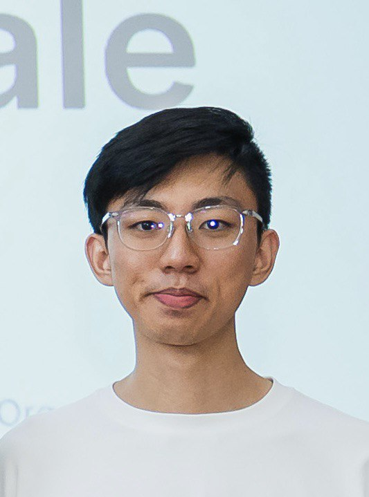

We are a team based in the [School of Computing, National University of Singapore](https://www.comp.nus.edu.sg).

You can reach us at the email `seer[at]comp.nus.edu.sg`

## Project team

### Nickson Ho

[[homepage](http://www.comp.nus.edu.sg/~damithch)]
[[github](https://github.com/nicksonho)]
[[portfolio](team/nicksonho.md)]

* Role: Developer
* Responsibilities: User Testing

### Li Mingyu

[[github](http://github.com/sophie-lmy)]
[[portfolio](team/sophie-lmy.md)]

* Role: Developer
* Responsibilities: Code Quality

### Wayne Tan

[[github](http://github.com/waynetanjh)]
[[portfolio](team/waynetanjh.md)]

* Role: Developer
* Responsibilities:
1. Scheduling and tracking: In charge of assigning and tracking project tasks.
2. Integration: In charge of versioning of the code, maintaining the code repository, integrating various parts of the software to create a whole.

### He Yati

[[github](http://github.com/yatihe01)]
[[portfolio](team/johndoe.md)]

* Role: Developer
* Responsibilities: Documentation checks

### Chee Yoong

[[github](http://github.com/cheeden)]
[[portfolio](team/cheeden.md)]

* Role: Developer
* Responsibilities: Features and UI
